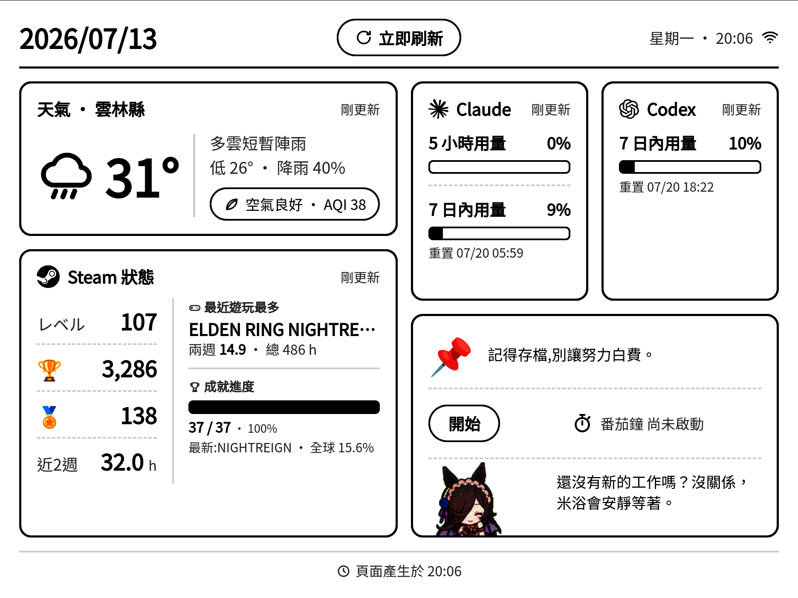

# epaper-desktop-dashboard

一個後端程式(FastAPI):定時抓天氣 / AQI / AI 額度(Claude·Codex)/ Steam 狀態 / 時段語錄,
存進 SQLite 快取,輸出一頁 **live HTML** 看板;右側另有前端番茄鐘與依時段／專注狀態切換的桌寵對話。電子閱讀器上的 app 開這個網頁即可顯示,
後端另可透過 **ADB** 定時叫電子閱讀器刷新(喚醒 + 重載 + e-ink full refresh)。

顯示端實測於 **HyRead Gaze Note Plus**(7.8" e-ink,1404×1872,Android 11),用 **Fully Kiosk** 滿版開網頁。
另附一個 Windows 系統匣桌面 App（`run_app.bat`):背景常駐服務 + 可叫出的預覽視窗,直接顯示區網網址與 IP。

## 預覽

實機 e-ink 畫面(`python -m app.device.adb screencap`,2026-07-13 擷取):



## 架構

```
資料源(API/本機時間) → 收集層(定時) → SQLite 快取 → live HTML(/) → 電子閱讀器開網頁顯示
                                                          ↑
                                          後端用 ADB 定時叫電子閱讀器刷新
```

三層獨立:任一資料源失敗,渲染讀舊快取續畫,只標精簡資料年齡,畫面不空白。
啟動時各來源並行抓取,不讓單一逾時串行拖慢整體啟動。

| 來源 | 更新節奏 |
|------|----------|
| 天氣、AQI | 每小時整點 |
| Steam 狀態 | 每半小時(:00、:30) |
| Claude、Codex、時段語錄 | 每 10 分鐘 |

### 模組

| 路徑 | 職責 |
|------|------|
| `app/collectors/` | 各來源收集器(依自己節奏抓,寫入快取) |
| `app/render/` | view-model(`view.py`)→ Jinja2 模板 → HTML 字串(`html.py`) |
| `app/net.py` | 共用 httpx(放寬 Py3.14 過嚴的 X509 strict,CWA 憑證才過) |
| `app/scheduler.py` | APScheduler:整點 cron 與 10 分鐘 interval job(＋選用 ADB 刷新 job) |
| `app/device/adb.py` | ADB 控制:connect / open / refresh / wake / screencap |
| `app/main.py` | FastAPI:`/`(看板)、`/health` |

## 開發(先在 PC 上測)

```bash
python -m venv .venv
# Windows PowerShell: .venv\Scripts\Activate.ps1
# bash:               source .venv/bin/activate
pip install -r requirements.txt

cp .env.example .env        # 填 CWA_API_KEY、CWA_LOCATION
python -m app.main
```

開 <http://localhost:8000/> 看看板。`/health` 保留頂層 `ok`,各啟用來源另回報
`available`、`age_seconds`、`stale`;超過兩倍收集週期才算 stale。

Windows 要背景常駐 + 系統匣預覽視窗:雙擊 `run_app.bat`(或 `python -m app.desktop`),
見 [GUIDE.md](GUIDE.md) §6.5。

## 驗證

```powershell
.venv/Scripts/python -m unittest discover -s tests -v
.venv/Scripts/python -m evals.device_screen  # 需連上真機;驗證 PNG 與 1404×1872
```

## 部署與電子閱讀器設定

見 [DEPLOY.md](DEPLOY.md):常駐主機開機自啟(systemd)、ADB 安裝與裝置配對、
kiosk 瀏覽器,以及「後端定時用 ADB 叫電子閱讀器刷新」的開啟方式。

## 建置進度

- [x] 骨架 + 假資料,打通「後端出頁 → 電子閱讀器顯示」
- [x] 天氣接真來源(CWA F-C0032-001),實測 200 + 真資料上頁
- [x] 架構轉為 live HTML
- [x] ADB 控制層(connect/open/refresh/wake/screencap);**已在實機 K08P 驗證**
- [x] Claude / Codex 額度皆實測真資料;參考 openusage。OpenRouter 程式保留但不啟用
- [x] Steam 狀態卡:帳號摘要(等級/成就/徽章/近兩週時數)+ 最近玩最多遊戲的成就進度
- [x] Windows 系統匣桌面 App(`run_app.bat`):背景服務 + 預覽視窗 + 區網 IP
- [x] 右側作息卡:時段語錄(早幽默 / 午打氣 / 晚療癒,空檔隨機提示)+ 前端番茄鐘(50 分 / 5 段,開始·停止)
- [x] 桌寵:依時段／番茄鐘切換姿態,每分鐘慢速換幀,並顯示各狀態隨機對話
- [x] ADB WiFi 斷線自動重連(offline 先 disconnect 再 connect)
- [x] 天氣 / AQI 每小時整點更新;Claude / Codex / 作息每 10 分鐘更新
- [x] 電子閱讀器全螢幕:Fully Kiosk 已裝並設定,實機驗證滿版(無系統列/工具列/網址列)
- [ ] 脫離 USB:改用主機區網 IP,電子閱讀器走 WiFi(目前 localhost + adb reverse 是 USB 綁定)
- [ ] Fully 鎖定/開機自啟 + e-ink full refresh 廣播 + 跨機憑證方案
- [ ] 預留:Notion / 一般 DB connector(目前不啟用)
